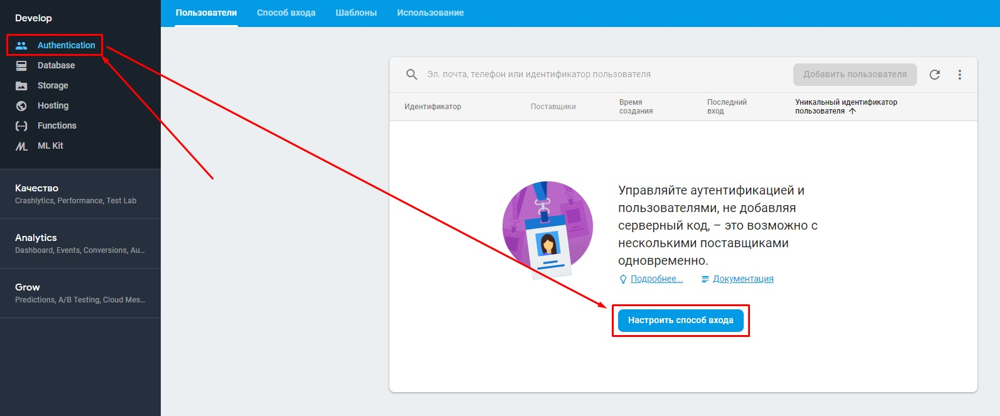

# Урок 7 - Авторизация в FireBase

[World-Skills-Juniors](https://pavlenkodr.github.io/World-Skills-Juniors/)

## Устанавливаем нужные пакеты

### Скачиваем пакеты в менеджере NuGet


### Настраиваем авторизацию

[Ссылка на консоль](https://console.firebase.google.com)


### Копируем имя пакета


### Жмем пропустить


### Включаем нужные параметры авторизации



### Указываем действие при сборке google-services.json


## Программная часть. Пишем код

В файле ```MainActivity.cs``` перед строчкой ```LoadApplication(new App());``` дописываем
```FirebaseApp.InitializeApp(Application.Context);```. Файл находится в части проекта, которая связана с Android

```cs
	// ...
	
	FirebaseApp.InitializeApp(Application.Context); // Добавляем эту строчку, иначе авторизация не будет работать
	LoadApplication(new App());
	
	// ...
```

Создадим интерфейс, в котором будут объявлены наши функции авторизации и регистрации.
Этот интерфейс создается в основной части проекта (которая на самом верху)
Назовем его для примера ```IFirebaseAuthenticator.cs```

```cs
using System;
using System.Threading.Tasks;

namespace FirebaseAuthentication
{
    public interface IFirebaseAuthenticator
    {
        // Логинимся анонимно
        Task<string> LoginWithEmailAnonymously();

        // Логинимся с логином и паролем
        Task<string> LoginWithEmailPassword(string email, string password);

        // Регистрируемся
        Task<string> RegsiterWithEmailPassword(string email, string password, string name, string secondName);
    }
}
```

А в андроидовской части уже напишем реальзацию работы с Xamarin.FirebaseAuth.
Такие сложности необходимы, так как невозможно установить Xamarin.FireBase.Auth для основной части проекта.
Назовем файл ```FirebaseAuthenticator.cs```

```cs
using System;
using System.Collections.Generic;
using System.Linq;
using System.Text;
using System.Threading.Tasks;
using Android.App;
using Android.Content;
using Android.OS;
using Android.Runtime;
using Android.Util;
using Android.Views;
using Android.Widget;
using Firebase.Auth;
using FirebaseAuthentication;
using Xamarin.Forms;

/////////////////////////////////////////////////////////////////
/////////////////////////////////////////////////////////////////
/////////////////////////////////////////////////////////////////
///                 ОЧЕНЬ ВАЖНАЯ СТРОЧКА                      ///
/////////////////////////////////////////////////////////////////
/////////////////////////////////////////////////////////////////
/////////////////////////////////////////////////////////////////
///   VVVVVVVVVVVVVVVVVVVVVVVVVVVVVVVVVVVVVVVVVVVVVVVVVVVVV   ///
[assembly: Dependency(typeof(MyApp.Droid.FirebaseAuthenticator))]
namespace MyApp.Droid
{
    public class FirebaseAuthenticator : IFirebaseAuthenticator
    {
        // Реализация функции из интерфейса IFirebaseAuthenticator
        public async Task<string> LoginWithEmailPassword(string email, string password)
        {
            // В этой переменной будет храниться результат авторизации
            IAuthResult authResult;
            try
            {
                authResult = await FirebaseAuth.Instance.
                             SignInWithEmailAndPasswordAsync(email, password);
            }
            catch (Exception)
            {
                // Тут кидаем свое исключение с самопальным сообщением.
                // Обрабатываться оно будет в месте где вызывалась функция LoginWithEmailPassword( ... )
                throw new ArgumentException("SignInWithEmailAndPasswordAsync error");
            }
            // В этой переменной будет храниться результат получения токена
            GetTokenResult tokenResult;
            try
            {
                tokenResult = await authResult.User.GetIdTokenAsync(false);
            }
            catch (Exception)
            {
                throw new ArgumentException("GetIdTokenAsync error");
            }
            return tokenResult.Token;
        }

        public async Task<string> LoginWithEmailAnonymously()
        {
            IAuthResult user;
            try
            {
                user = await FirebaseAuth.Instance.
                             SignInAnonymouslyAsync();
            }
            catch (Exception)
            {
                throw new ArgumentException("SignInAnonymouslyAsync error");
            }
            GetTokenResult token;
            try
            {
                token = await user.User.GetIdTokenAsync(false);
            }
            catch (Exception)
            {
                throw new ArgumentException("GetIdTokenAsync error");
            }
            return token.Token;
        }

        public async Task<string> RegsiterWithEmailPassword(string email, string password, string name, string secondName)
        {
			// Тут лучше все завернуть в try-catch по примеру выше
            var user = await FirebaseAuth.Instance.CreateUserWithEmailAndPasswordAsync(email, password);
            var token = await user.User.GetIdTokenAsync(false);
            return token.Token;
        }
    }
}
```

### Верстаем страницу

#### Frontend

```xaml
<?xml version="1.0" encoding="UTF-8"?>
<ContentPage xmlns="http://xamarin.com/schemas/2014/forms" 
             xmlns:x="http://schemas.microsoft.com/winfx/2009/xaml"
             x:Class="MyApp.View3">
    <!-- ContentPage - одина из самых простых страниц
    В ContentPage.Content Кладется макет -->
    <ContentPage.Content>
        <!-- StackLayout - один из видов макетов. Например этот складывает все объекты в ряд
        HorizontalOptions - указывает на то, что объекты внутри макета будут по центу слева направо
        VerticalOptions   - указывает на то, что объекты внутри макета будут по центу сверху вниз  -->
        <StackLayout VerticalOptions="CenterAndExpand" HorizontalOptions="CenterAndExpand">
            <!-- Entry - поле для ввода. Placeholder - подсказка -->
            <Entry x:Name="l" Text="pavlenkocraft@gmail.com" Placeholder="Введите логин"></Entry>
            <!-- IsPassword превращает наш текст в точки -->
            <Entry x:Name="p" IsPassword="true" Text="qweqweqwe" Placeholder="Введите пароль"></Entry>
            <!-- Кнопка. Button_Clicked - функция, которая будет вызываться при клике
            на кнопку. Ее реализация создалась в файле View2.xaml.cs -->
            <Button Text="Логин" Clicked ="Button_Clicked"></Button>
            <Button Text="Анонимно" Clicked = "Button_Clicked_1"></Button>
            <!-- Просто текст, который отображается на странице.
            С помощью x:Name мы управляем лейблом из файла View2.xaml.cs -->
            <Label Text="Hello Xamarin.Forms!" x:Name="autt" />
        </StackLayout>
    </ContentPage.Content>
</ContentPage>
```

#### Backend

```cs
using FirebaseAuthentication;
using System;
using System.Collections.Generic;
using System.Linq;
using System.Text;
using System.Threading.Tasks;

using Xamarin.Forms;
using Xamarin.Forms.Xaml;

namespace MyApp
{
    [XamlCompilation(XamlCompilationOptions.Compile)]
	public partial class View3 : ContentPage
	{
		public View3 ()
		{
		    InitializeComponent ();
		}

        // С помощью этой функции проверяем, заполнены ли поля с логином и паролем
        private bool CheckValidatiions()
        {
            // l - Entry в xaml. Хранит логин
            // p - Entry в xaml. Хранит пароль

            // IsNullOrEmpty( string ) - если строка пустая, то вернет true, иначе false
            if (string.IsNullOrEmpty(l.Text))
            {
                // Вывести сообщение с предупреждением
                DisplayAlert("Alert", "Enter email", "ok");
                return false;
            }
            if (string.IsNullOrEmpty(p.Text))
            {

                DisplayAlert("Alert", "Enter password", "ok");
                return false;
            }
            return true;
        }

        // Реализация функции, которая вызывается при нажатии на кнопку
        // Она привязывается в файле xaml
        private async void Button_Clicked(object sender, EventArgs e)
        {
            // С помощью CheckValidatiions() проверяем, что нужные поля заполнены
            if (CheckValidatiions())
            {
                string token;
                // В области try пытаемся выполнить код, если что-то ломается, то выполняется блок catch
                try
                {
                    // Блок try
                    // Реализация IFirebaseAuthenticator лежит в файле IFirebaseAuthenticator.cs
                    // С помощью DependencyService.Get<>() мы цепляем реализацию класса из андроидовской части, условно говоря
                    // То есть по сути функция LoginWithEmailPassword() будет вызвана из файла FirebaseAuthenticator.cs
                    token = await DependencyService.Get<IFirebaseAuthenticator>().LoginWithEmailPassword(l.Text, p.Text);
                }
                catch (ArgumentException exp)
                {
                    // Блок catch, в котором мы обрабатываем самостоятельно созданную ошибку
                    // Она отсылается, наример, в функции LoginWithEmailPassword() и имеет тип ArgumentException
                    // Message - текст, который мы написали в ошибке
                    token = exp.Message;
                }
                catch (Exception)
                {
                    // Тут обрабатываем остальные ошибки
                    token = "Another error";
                }
                // Отображаем полученный токен
                autt.Text = token;
            }
        }

        // Реализация функции, которая вызывается при нажатии на кнопку
        // Она привязывается в файле xaml
        private async void Button_Clicked_1(object sender, EventArgs e)
        {
            string token;
            try
            {
                token = await DependencyService.Get<IFirebaseAuthenticator>().LoginWithEmailAnonymously();
            }
            catch (ArgumentException exp)
            {
                token = exp.Message;
            }
            catch (Exception)
            {
                token = "Another error";
            }
            // autt указан в Label в поле x:Name. Этот Label инициализирован в файле View3.xaml
            autt.Text = token;
        }
    }
}
```

Получили токен - значит авторизировались
Функция регистрации добавляется по аналогии.

[World-Skills-Juniors](https://pavlenkodr.github.io/World-Skills-Juniors/)
