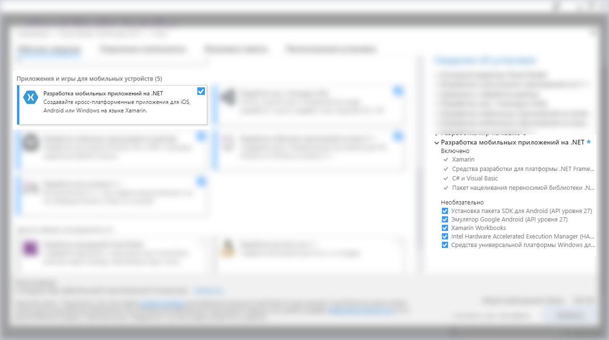
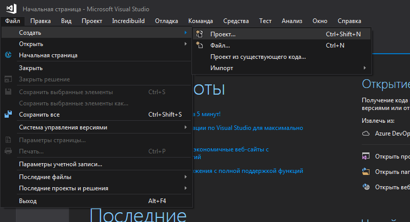
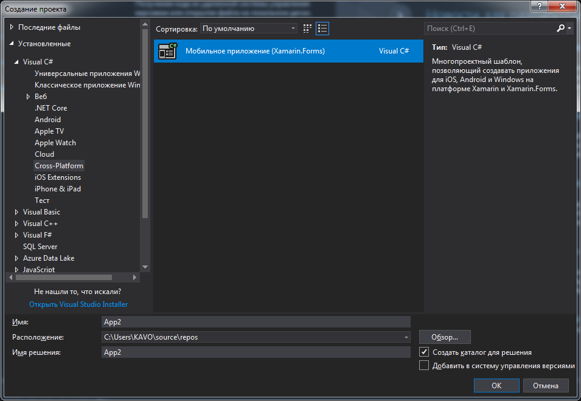
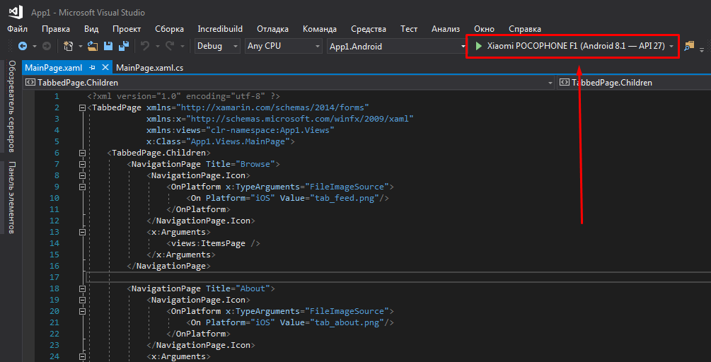
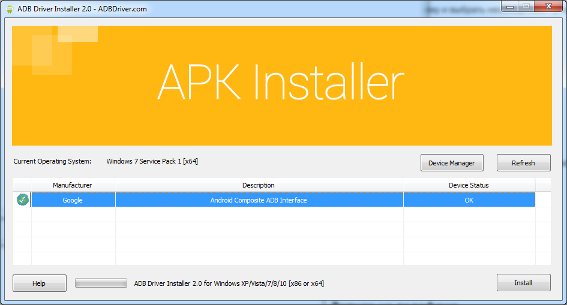
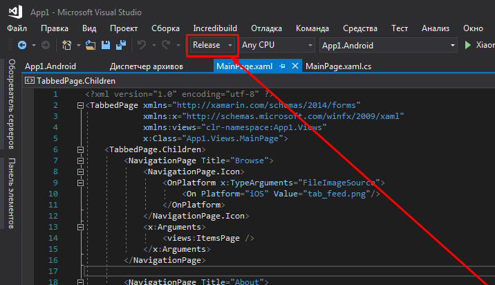
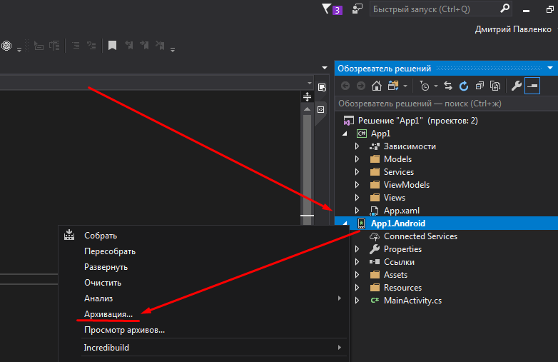
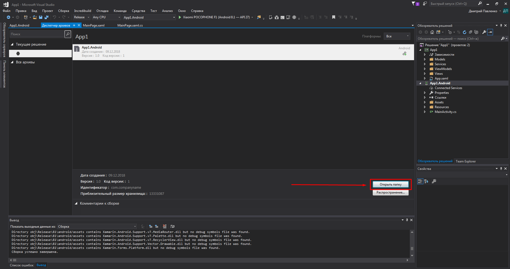

# Урок 1 - Знакомство с Xamarin.Forms

## Установка необходимого ПО

1. Скачать Microsoft Visual Studio 2017

https://visualstudio.microsoft.com/ru/thank-you-downloading-visual-studio/?sku=Community&rel=15

2. Запустить установку и выбрать необходимые пункты



## Создание учетной записи Microsoft

https://signup.live.com/

## Создание первого приложения

1. Запускаем Microsoft Visual Studio
2. Файл -> Создать -> Проект



3. Visual C# -> Cross-platform -> Мобильное приложение (Xamarin.Forms)



4. Blank -> OK

Подробнее по ссылкам:

https://docs.microsoft.com/ru-ru/xamarin/xamarin-forms/get-started/first-app/?pivots=windows

https://docs.microsoft.com/ru-ru/xamarin/xamarin-forms/get-started/hello-xamarin-forms/quickstart?pivots=windows

## Сборка и запуск приложения



## Запуск на телефоне (Способ 1)

1. Перевести телефон в режим разработчика. Для каждого телефона индивидуально.
2. Если телефон не появился в месте указанном на 4 картинке, то необходимо скачать драйвера по ссылке
http://dl.adbdriver.com/upload/adbdriver.zip
3. Распаковать и запустить ADBDriverInstaller.
4. Выбрать необходимый телефон и нажать Install



5. Выбираем телефон в месте как на картинке 4 и запускаем

## Запуск на телефоне (Способ 2)

1. Вместо Debug выбрать Release как показано на картинке ниже



2. Обозреватель решений -> Правай кнопка выше по Android проекту -> Архивация



3. Открываем папку -> Копируем файл с расширением .apk на телефон и устанавливаем



## Несколько слов о программировании

Типы значений:

* int - целочисленный
* float - дробный
* string - строка
* bool - логический

Например:

```cs
int a; // Завели переменную
a = 5; // Указали, что она будет равна пяти
int b = 3; // Завели и указали
int c = a + b; // Тут будет 8
c = c + 2; // Будет 10
c += 11; // 22
c++; //23


float d = 1.012;
string str = "stroka";
bool logic = true;
```

Примеры операторов:

```cs
bool e = true;
if ( e ) // Условие
{
	// Выполнится
}
else
{
	// Не выполнится
}

// ( завели переменную, обнулили ее; поставили условие; выполняем действие для каждой итерации )
for (int i = 0; i < 10; i++) 
{
   // i будет равно числам 0, 1, ..., 9
}
```

Также есть break - он прерывает цикл

```cs
for (int i = 0; i < 10; i++) 
{
   // i будет равно числам 0, 1, ..., 5
   if ( i == 5 ) // Условие выполнится когда i будет равен 5
   {
		break; // И цикл прервется
   }
}
```

Также есть функции, которые возвращают значение

```cs
// Ответом функции будет целочисленное значение ( int )
// Название функции MyFunc
// Принимает целочисленные a и b
int MyFunc( int a, int b )
{
	return a + b; // Вернет ответ a + b
}

// ...

int g = MyFunc( 2, 6 ); // 2 + 6 == 8
```

Примеры классов, на подобии класса App в стандартном шаблоне Visual Studio

```cs
// public - класс виден всем
// Point - название класса
public class Point
{
    public int x, y; // Класс содержит в себе поля x и y. Так как они public к ним можно обратиться
    public Point()   // Конструктор класса. У него такое же название как и у класса
    {                // Можно сказать, что конструктор - это функция, которая вызывается при создании класса
        this.x = 0;  // Теперь объект класса будет хранить в переменной x цифру 0
        this.y = 0;  // И тут тоже 0
    }
    public Point(int x, int y) // Конструктор класса, который принимает в себя значения
    {                          // Например x = 5, y = 6
        this.x = x; // Теперь объект класса будет хранить в переменной x цифру 5
        this.y = y; // Тут 6
    }
}

// ...

// point - объект класса Point
// объекты класса нужно создавать с помощью new
Point point = new Point(); // x == 0, y == 0
int h = point.x + point.y; // Тоже ноль

point = new Point( 5, 6 ); // x == 5, y == 6
h = point.x + point.y      // Будет 11
```

Подробнее:

https://docs.microsoft.com/ru-ru/dotnet/csharp/tour-of-csharp/

## Xamarin.Forms

https://docs.microsoft.com/ru-ru/xamarin/xamarin-forms/

* Виды страниц

https://docs.microsoft.com/ru-ru/xamarin/xamarin-forms/user-interface/controls/pages

* Макеты

https://docs.microsoft.com/ru-ru/xamarin/xamarin-forms/user-interface/controls/layouts

* Элементы

https://docs.microsoft.com/ru-ru/xamarin/xamarin-forms/user-interface/controls/views

Примеры кода

https://github.com/xamarin/xamarin-forms-samples/tree/master/FormsGallery